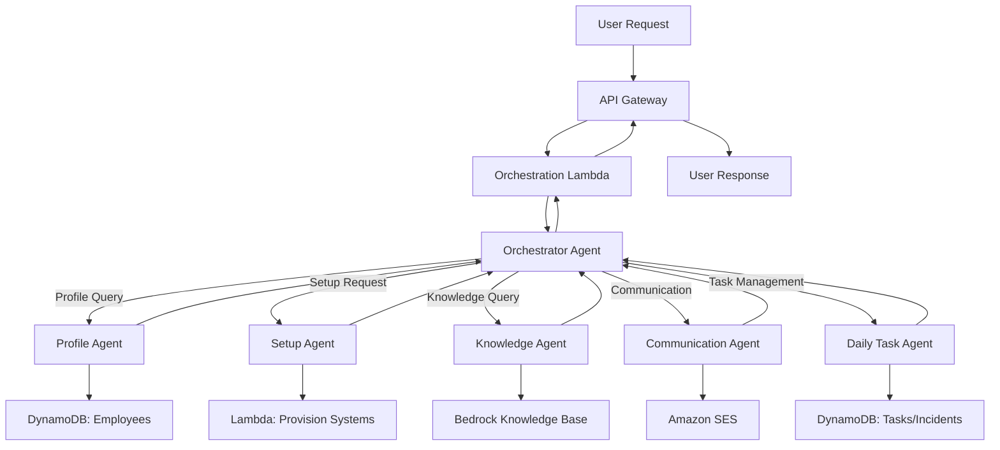
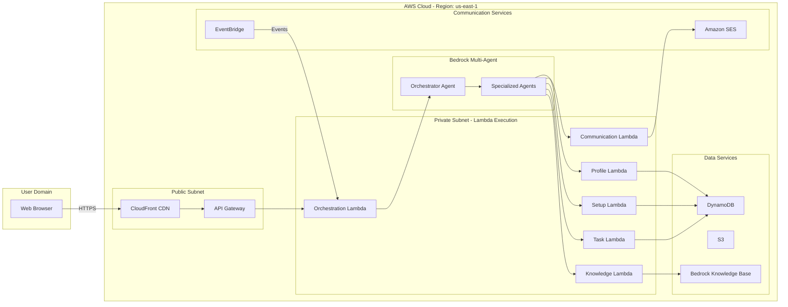
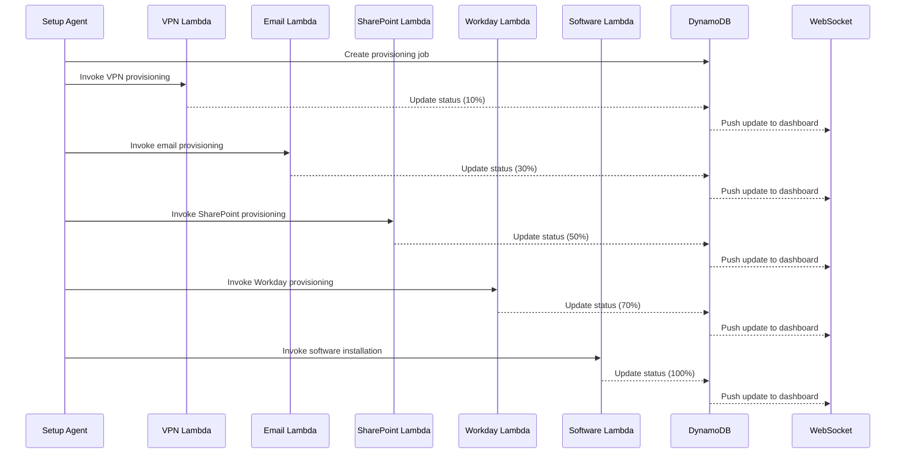
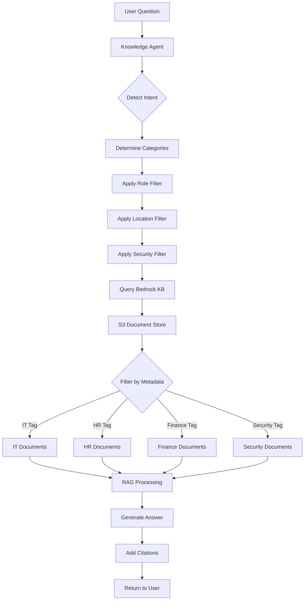
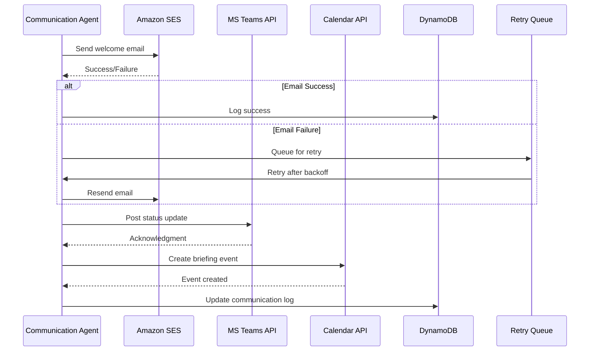
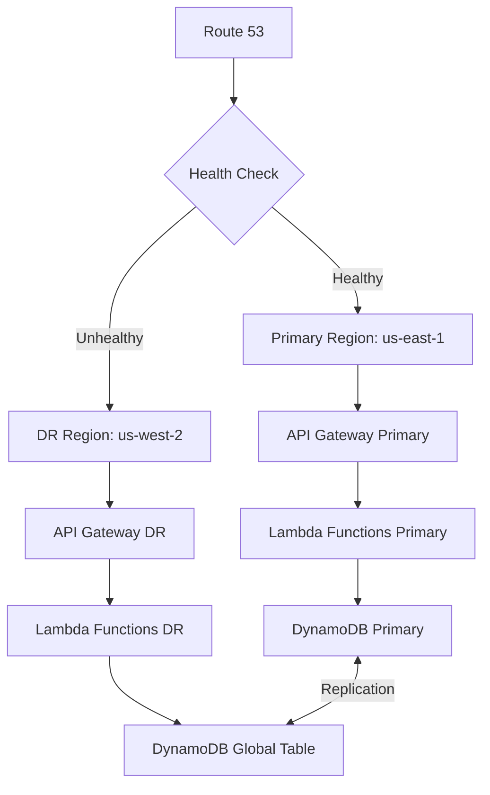

# Design Document: AWS-IQ Multi-Agent IT Onboarding System

## Overview

The AWS-IQ system is a comprehensive multi-agent IT onboarding platform that leverages Amazon Bedrock Multi-Agent Collaboration to automate and streamline employee onboarding processes. The system employs a coordinator-specialist architecture where an orchestrator agent coordinates five specialized agents, each responsible for distinct onboarding domains.

### System Goals

1. **Automation**: Minimize manual intervention in employee onboarding workflows
2. **Coordination**: Orchestrate multiple specialized AI agents to handle complex, multi-faceted onboarding tasks
3. **Scalability**: Support concurrent onboarding of multiple employees without performance degradation
4. **Intelligence**: Provide context-aware, role-based information delivery through knowledge base integration
5. **Real-time Visibility**: Offer live progress tracking and status updates throughout the onboarding journey

### Key Design Principles

- **Separation of Concerns**: Each agent has a single, well-defined responsibility domain
- **Event-Driven Architecture**: Asynchronous communication patterns enable independent agent operation
- **Serverless-First**: Leverage AWS Lambda and managed services to minimize operational overhead
- **Data-Driven**: All agent decisions and responses are informed by structured data in DynamoDB
- **Security by Design**: Apply principle of least privilege and encryption throughout the system

## Architecture

### High-Level Architecture

The system follows a multi-tier architecture with clear separation between presentation, orchestration, business logic, and data layers:

```
┌─────────────────────────────────────────────────────────────┐
│                    Presentation Layer                        │
│  ┌────────────────────────────────────────────────────────┐ │
│  │  Web Dashboard (HTML/CSS/JavaScript)                   │ │
│  │  - Profile Card    - Setup Progress   - Org Chart     │ │
│  │  - Daily Tasks     - AI Chat         - FAQ Section    │ │
│  └────────────────────────────────────────────────────────┘ │
└──────────────────────────┬──────────────────────────────────┘
                           │ HTTPS
                           ↓
┌─────────────────────────────────────────────────────────────┐
│                      API Layer                               │
│  ┌────────────────────────────────────────────────────────┐ │
│  │  Amazon API Gateway (REST API)                         │ │
│  │  - Authentication      - Rate Limiting                 │ │
│  │  - Request Routing     - Response Transformation       │ │
│  └────────────────────────────────────────────────────────┘ │
└──────────────────────────┬──────────────────────────────────┘
                           │
                           ↓
┌─────────────────────────────────────────────────────────────┐
│                  Orchestration Layer                         │
│  ┌────────────────────────────────────────────────────────┐ │
│  │  Orchestrator Agent (Amazon Bedrock)                   │ │
│  │  - Task Delegation    - State Management               │ │
│  │  - Response Aggregation                                │ │
│  └────────────────────────────────────────────────────────┘ │
│           │              │              │                    │
│     ┌─────┴─────┬────────┴────┬─────────┴────┬──────────┐  │
│     ↓           ↓             ↓              ↓          ↓   │
│  ┌──────┐  ┌──────┐  ┌───────────┐  ┌─────────┐  ┌─────┐  │
│  │Profile│  │Setup │  │Knowledge  │  │Comm.    │  │Daily│  │
│  │Agent  │  │Agent │  │Agent      │  │Agent    │  │Task │  │
│  └──────┘  └──────┘  └───────────┘  └─────────┘  └─────┘  │
└──────────────────────────┬──────────────────────────────────┘
                           │
                           ↓
┌─────────────────────────────────────────────────────────────┐
│                  Business Logic Layer                        │
│  ┌────────────────────────────────────────────────────────┐ │
│  │  AWS Lambda Functions (Python)                         │ │
│  │  - Profile Handler    - Setup Handler                  │ │
│  │  - Knowledge Handler  - Communication Handler          │ │
│  │  - Daily Task Handler - Orchestration Handler          │ │
│  └────────────────────────────────────────────────────────┘ │
└──────────────────────────┬──────────────────────────────────┘
                           │
                           ↓
┌─────────────────────────────────────────────────────────────┐
│                      Data Layer                              │
│  ┌──────────────────┐  ┌────────────────┐  ┌─────────────┐ │
│  │   DynamoDB       │  │  S3 Document   │  │  Bedrock KB │ │
│  │   Tables         │  │  Store         │  │             │ │
│  │  - Employees     │  │  - IT/HR Docs  │  │  - Vector   │ │
│  │  - OrgChart      │  │  - Policies    │  │    Store    │ │
│  │  - Tasks         │  │  - Procedures  │  │             │ │
│  │  - Incidents     │  └────────────────┘  └─────────────┘ │
│  │  - FAQs          │                                       │
│  └──────────────────┘                                       │
└─────────────────────────────────────────────────────────────┘
```

### Multi-Agent Collaboration Architecture

The system implements a **Supervisor Pattern** for multi-agent orchestration, where the Orchestrator Agent acts as the central coordinator:



#### Agent Communication Protocol

Agents communicate through structured message passing coordinated by the Orchestrator:

1. **Request Message Format**:
```json
{
  "requestId": "uuid",
  "timestamp": "ISO-8601",
  "agentType": "profile|setup|knowledge|communication|daily_task",
  "action": "string",
  "parameters": {},
  "context": {
    "employeeId": "string",
    "sessionId": "string"
  }
}
```

2. **Response Message Format**:
```json
{
  "requestId": "uuid",
  "timestamp": "ISO-8601",
  "agentType": "string",
  "status": "success|partial|failure",
  "data": {},
  "errors": [],
  "metadata": {
    "processingTime": "milliseconds",
    "retryCount": "integer"
  }
}
```

### Deployment Architecture



## Components and Interfaces

### 1. Orchestrator Agent

**Purpose**: Central coordinator that manages task delegation, agent communication, and response aggregation.

**Responsibilities**:
- Receive and parse user requests from API Gateway
- Determine which specialized agents are needed for each request
- Route sub-tasks to appropriate specialist agents
- Aggregate responses from multiple agents
- Maintain overall onboarding workflow state
- Handle agent failures and implement retry logic

**Interface**:
```python
class OrchestratorAgent:
    def route_request(self, request: Request) -> List[AgentTask]:
        """Analyze request and determine required agents"""
        pass
    
    def delegate_tasks(self, tasks: List[AgentTask]) -> List[Future]:
        """Send tasks to specialized agents asynchronously"""
        pass
    
    def aggregate_responses(self, responses: List[AgentResponse]) -> Response:
        """Combine multiple agent responses into unified result"""
        pass
    
    def update_state(self, employee_id: str, progress: ProgressUpdate):
        """Update overall onboarding progress"""
        pass
    
    def handle_agent_failure(self, agent_type: str, error: Exception) -> RecoveryAction:
        """Implement fallback and retry logic"""
        pass
```

**Integration Points**:
- **Input**: API Gateway via Orchestration Lambda
- **Output**: Specialized agents via Bedrock Multi-Agent API
- **State Storage**: DynamoDB for workflow state persistence

### 2. Profile Agent

**Purpose**: Manages employee profile data and organizational chart information.

**Responsibilities**:
- Fetch employee profile from DynamoDB
- Retrieve job scope and role information
- Generate organizational chart data with hierarchy relationships
- Provide contact information for team members
- Update profile data in real-time

**Interface**:
```python
class ProfileAgent:
    def get_employee_profile(self, employee_id: str) -> EmployeeProfile:
        """Retrieve complete employee profile"""
        pass
    
    def get_organizational_chart(self, employee_id: str) -> OrgChart:
        """Generate org chart centered on employee"""
        pass
    
    def get_team_contacts(self, team_id: str) -> List[Contact]:
        """Retrieve contact info for team members"""
        pass
    
    def update_profile(self, employee_id: str, updates: Dict) -> UpdateResult:
        """Update employee profile data"""
        pass
```

**Data Access Patterns**:
- **Primary**: GetItem by employee_id (partition key)
- **Secondary**: Query by department or manager_id (GSI)
- **Real-time**: DynamoDB Streams for live updates

**Integration Points**:
- **Data Source**: DynamoDB Employees table
- **Output**: JSON profile and org chart data
- **Real-time Updates**: WebSocket API for dashboard updates

### 3. Setup Agent

**Purpose**: Orchestrates IT system provisioning and access setup for new employees.

**Responsibilities**:
- Initiate VPN access provisioning
- Simulate email account creation
- Simulate SharePoint access setup
- Simulate Workday system access
- Simulate software installation
- Track provisioning progress and report status

**Interface**:
```python
class SetupAgent:
    def initiate_onboarding(self, employee_id: str) -> OnboardingJob:
        """Start complete IT provisioning workflow"""
        pass
    
    def provision_vpn(self, employee_id: str) -> ProvisioningResult:
        """Setup VPN access"""
        pass
    
    def provision_email(self, employee_id: str) -> ProvisioningResult:
        """Create email account"""
        pass
    
    def provision_sharepoint(self, employee_id: str) -> ProvisioningResult:
        """Setup SharePoint access"""
        pass
    
    def provision_workday(self, employee_id: str) -> ProvisioningResult:
        """Setup Workday access"""
        pass
    
    def install_software(self, employee_id: str, software_list: List[str]) -> ProvisioningResult:
        """Initiate software installation"""
        pass
    
    def get_provisioning_status(self, job_id: str) -> ProvisioningStatus:
        """Check overall provisioning progress"""
        pass
```

**Provisioning Workflow**:


**Integration Points**:
- **Execution**: AWS Lambda functions for each provisioning task
- **Progress Tracking**: DynamoDB for status persistence
- **Real-time Updates**: WebSocket for dashboard notifications
- **Timeout**: 30-minute completion SLA

### 4. Knowledge Agent

**Purpose**: Provides intelligent access to company knowledge base with context-aware filtering.

**Responsibilities**:
- Detect user question intent automatically
- Filter knowledge base by employee role and location
- Apply category-based document filtering
- Retrieve relevant documents from Bedrock Knowledge Base
- Provide source citations for all answers
- Aggregate information across multiple categories

**Interface**:
```python
class KnowledgeAgent:
    def query_knowledge_base(self, 
                            question: str, 
                            employee_context: EmployeeContext) -> KnowledgeResponse:
        """Query knowledge base with context filtering"""
        pass
    
    def detect_intent(self, question: str) -> Intent:
        """Classify question intent and determine relevant categories"""
        pass
    
    def apply_filters(self, 
                     query: str,
                     role: str,
                     location: str,
                     categories: List[str],
                     clearance: str) -> FilteredQuery:
        """Apply role, location, category, and security filters"""
        pass
    
    def retrieve_documents(self, filtered_query: FilteredQuery) -> List[Document]:
        """Retrieve relevant documents from knowledge base"""
        pass
    
    def generate_answer(self, 
                       documents: List[Document], 
                       question: str) -> Answer:
        """Generate answer with source citations"""
        pass
```

**Knowledge Base Architecture**:



**Metadata Filtering Strategy**:
- **Category Tags**: IT, HR, Finance, Security, Operations, Compliance
- **Role-Based**: Filter by job_role metadata field
- **Location-Based**: Filter by site_location metadata field
- **Security Clearance**: Filter by clearance_level (Public, Internal, Confidential, Restricted)

**Integration Points**:
- **Knowledge Base**: Amazon Bedrock Knowledge Base with vector embeddings
- **Document Store**: S3 bucket with tagged documents
- **Query Processing**: Bedrock Retrieve API with metadata filters
- **Response Time**: 5-second SLA for query responses

### 5. Communication Agent

**Purpose**: Manages automated communications and notifications across multiple channels.

**Responsibilities**:
- Send welcome emails to new employees
- Send notification emails to managers
- Post status updates to Microsoft Teams
- Create calendar briefings for managers
- Send progress updates at milestones
- Implement retry logic for failed communications

**Interface**:
```python
class CommunicationAgent:
    def send_welcome_email(self, employee_id: str) -> SendResult:
        """Send welcome email via Amazon SES"""
        pass
    
    def notify_manager(self, manager_id: str, employee_id: str) -> SendResult:
        """Send manager notification"""
        pass
    
    def post_to_teams(self, channel_id: str, message: str) -> SendResult:
        """Post status to Microsoft Teams channel"""
        pass
    
    def create_calendar_event(self, manager_id: str, event: CalendarEvent) -> SendResult:
        """Create calendar briefing"""
        pass
    
    def send_milestone_update(self, employee_id: str, milestone: str) -> SendResult:
        """Send progress update notification"""
        pass
    
    def retry_failed_communication(self, communication_id: str) -> RetryResult:
        """Retry failed communications with exponential backoff"""
        pass
```

**Communication Flow**:


**Retry Strategy**:
- **Maximum Retries**: 3 attempts
- **Backoff**: Exponential (2^n seconds: 2s, 4s, 8s)
- **Timeout**: 2 minutes per communication attempt
- **Dead Letter Queue**: Failed communications after 3 retries

**Integration Points**:
- **Email**: Amazon SES for transactional emails
- **Teams**: Microsoft Graph API for Teams integration
- **Calendar**: Microsoft Graph API for calendar events
- **Logging**: DynamoDB for communication audit trail
- **Retry**: SQS with visibility timeout for retry logic

### 6. Daily Task Agent

**Purpose**: Manages daily tasks, incidents, and training assignments for employees.

**Responsibilities**:
- Fetch current day's incidents from DynamoDB
- Retrieve assigned tasks for employees
- Fetch required training assignments
- Update task and incident data in real-time
- Notify employees of new incidents
- Allow task status updates through dashboard
- Update completion status in DynamoDB

**Interface**:
```python
class DailyTaskAgent:
    def get_daily_incidents(self, employee_id: str, date: str) -> List[Incident]:
        """Retrieve incidents for current day"""
        pass
    
    def get_assigned_tasks(self, employee_id: str) -> List[Task]:
        """Retrieve employee's assigned tasks"""
        pass
    
    def get_training_assignments(self, employee_id: str) -> List[Training]:
        """Retrieve required training"""
        pass
    
    def update_task_status(self, task_id: str, status: str) -> UpdateResult:
        """Update task completion status"""
        pass
    
    def notify_new_incident(self, employee_id: str, incident: Incident) -> NotificationResult:
        """Send incident notification within 1 minute"""
        pass
    
    def subscribe_to_updates(self, employee_id: str) -> WebSocketConnection:
        """Establish WebSocket for real-time updates"""
        pass
```

**Data Access Patterns**:
- **Incidents**: Query by date (partition key) and employee_id (sort key)
- **Tasks**: Query by employee_id with status filter
- **Training**: Query by employee_id with completion status
- **Real-time**: DynamoDB Streams trigger Lambda for notifications

**Integration Points**:
- **Data Source**: DynamoDB Tasks and Incidents tables
- **Notifications**: EventBridge for incident alerts
- **Real-time**: WebSocket API for live dashboard updates
- **SLA**: 1-minute notification delivery with retry fallback

### 7. API Gateway

**Purpose**: Provides secure, scalable REST API for frontend-backend communication.

**Endpoints**:

```
GET    /api/v1/profile/{employeeId}              - Get employee profile
GET    /api/v1/profile/{employeeId}/orgchart     - Get organizational chart
POST   /api/v1/onboarding/start                  - Start onboarding process
GET    /api/v1/onboarding/{jobId}/status         - Get provisioning status
POST   /api/v1/knowledge/query                   - Query knowledge base
GET    /api/v1/tasks/{employeeId}                - Get daily tasks
PUT    /api/v1/tasks/{taskId}/status             - Update task status
GET    /api/v1/incidents/{employeeId}            - Get incidents
GET    /api/v1/faq                                - Get FAQ list
GET    /api/v1/health                             - Health check endpoint
```

**Security Features**:
- **Authentication**: OAuth 2.0 / SAML 2.0 integration with corporate IdP
- **Authorization**: JWT token validation on all endpoints
- **Rate Limiting**: 1000 requests per minute per user
- **HTTPS**: TLS 1.3 enforcement
- **CORS**: Configured for web dashboard domain only

**Request/Response Format**:

Standard Response Envelope:
```json
{
  "status": "success|error",
  "data": {},
  "error": {
    "code": "string",
    "message": "string"
  },
  "metadata": {
    "requestId": "uuid",
    "timestamp": "ISO-8601",
    "version": "v1"
  }
}
```

### 8. Lambda Functions

**Function Architecture**:

Each Lambda function follows a layered structure:
- **Handler Layer**: API Gateway event parsing and response formatting
- **Service Layer**: Business logic and agent coordination
- **Data Access Layer**: DynamoDB and S3 operations
- **Integration Layer**: External service calls (Bedrock, SES, etc.)

**Function Specifications**:

| Function | Runtime | Memory | Timeout | Concurrency |
|----------|---------|--------|---------|-------------|
| Orchestration | Python 3.12 | 512 MB | 300s | 100 |
| Profile | Python 3.12 | 256 MB | 30s | 50 |
| Setup | Python 3.12 | 512 MB | 900s | 20 |
| Knowledge | Python 3.12 | 1024 MB | 60s | 100 |
| Communication | Python 3.12 | 256 MB | 60s | 50 |
| Task | Python 3.12 | 256 MB | 30s | 50 |

**Common Patterns**:

```python
# Standard Lambda handler structure
import json
import boto3
from typing import Dict, Any

def lambda_handler(event: Dict[str, Any], context: Any) -> Dict[str, Any]:
    try:
        # Parse request
        request = parse_api_gateway_event(event)
        
        # Validate input
        validate_request(request)
        
        # Execute business logic
        result = process_request(request)
        
        # Format response
        return format_success_response(result)
        
    except ValidationError as e:
        return format_error_response(400, str(e))
    except Exception as e:
        logger.error(f"Unhandled error: {str(e)}")
        return format_error_response(500, "Internal server error")
```

### 9. Web Dashboard

**Technology Stack**:
- **Frontend**: HTML5, CSS3, ES6+ JavaScript
- **Styling**: CSS Grid, Flexbox for responsive layout
- **Real-time**: WebSocket API for live updates
- **State Management**: Local storage for session persistence
- **HTTP Client**: Fetch API for backend communication

**Dashboard Components**:

1. **Profile Card**:
   - Employee photo, name, title, department
   - Contact information
   - Quick access to profile settings

2. **Setup Progress Bar**:
   - Visual progress indicator (0-100%)
   - Step-by-step breakdown (VPN, Email, SharePoint, Workday, Software)
   - Real-time updates via WebSocket
   - Estimated completion time

3. **Organizational Chart**:
   - Interactive hierarchy visualization
   - Click to view contact details popup
   - Microsoft Teams deeplink (teams://...)
   - Email mailto link
   - Zoom and pan controls

4. **Daily Tasks Panel**:
   - Today's incidents (priority, description, status)
   - Assigned tasks (checkbox for completion)
   - Training assignments (with progress)
   - Sortable and filterable

5. **AI Chat Interface**:
   - Text input for questions
   - Streaming responses from Knowledge Agent
   - Source citations with document links
   - Chat history persistence

6. **FAQ Section**:
   - Categorized questions (IT Setup, HR, Benefits, Workspace, Getting Started)
   - Expandable/collapsible answers
   - Keyword search filter
   - View count tracking
   - Link to AI chat if answer not found

**Responsive Design Breakpoints**:
- Desktop: 1200px+
- Tablet: 768px - 1199px
- Mobile: 320px - 767px

**Performance Targets**:
- Initial load: < 3 seconds
- Time to interactive: < 5 seconds
- WebSocket reconnection: < 2 seconds
- Smooth animations: 60 FPS

## Data Models

### DynamoDB Table Design

#### 1. Employees Table

**Purpose**: Store employee profiles and organizational data

**Schema**:
```
Table: Employees
Partition Key: employeeId (String)
Sort Key: None (Simple primary key)

Attributes:
- employeeId: String (PK)
- firstName: String
- lastName: String
- email: String
- phone: String
- photoUrl: String
- jobTitle: String
- department: String
- managerId: String
- siteLocation: String
- role: String (enum: Engineer, Manager, HR, Finance, etc.)
- securityClearance: String (enum: Public, Internal, Confidential, Restricted)
- hireDate: String (ISO-8601)
- status: String (enum: Active, Onboarding, Inactive)
- createdAt: String (ISO-8601)
- updatedAt: String (ISO-8601)

GSI-1: ManagerIndex
- Partition Key: managerId
- Sort Key: employeeId
- Purpose: Query all employees under a manager

GSI-2: DepartmentIndex
- Partition Key: department
- Sort Key: employeeId
- Purpose: Query all employees in a department

GSI-3: LocationIndex
- Partition Key: siteLocation
- Sort Key: department
- Purpose: Query employees by location and department
```

**Access Patterns**:
1. Get employee by ID: `GetItem(employeeId)`
2. Get all direct reports: `Query(GSI-1, managerId)`
3. Get department roster: `Query(GSI-2, department)`
4. Get employees by location: `Query(GSI-3, siteLocation)`

**Capacity Planning**:
- Expected items: 10,000 employees
- Average item size: 2 KB
- Read pattern: 90% GetItem, 10% Query
- Write pattern: 5% inserts, 95% updates
- Provisioned: On-demand mode for variable load

#### 2. OrgChart Table

**Purpose**: Store organizational hierarchy relationships

**Schema**:
```
Table: OrgChart
Partition Key: nodeId (String)
Sort Key: None

Attributes:
- nodeId: String (PK) - Format: "EMP#{employeeId}"
- employeeId: String
- parentNodeId: String
- level: Number (0 = CEO, 1 = VP, etc.)
- path: String (e.g., "CEO/VP-Engineering/Director-Backend")
- childCount: Number
- metadata: Map (position coordinates for visualization)

GSI-1: ParentIndex
- Partition Key: parentNodeId
- Sort Key: level
- Purpose: Query all children of a node

GSI-2: LevelIndex
- Partition Key: level
- Sort Key: nodeId
- Purpose: Query all nodes at a specific hierarchy level
```

**Access Patterns**:
1. Get org node: `GetItem(nodeId)`
2. Get direct reports: `Query(GSI-1, parentNodeId)`
3. Get all at level: `Query(GSI-2, level)`
4. Get full path: Recursive queries up the hierarchy

#### 3. Tasks Table

**Purpose**: Store daily tasks and assignments

**Schema**:
```
Table: Tasks
Partition Key: employeeId (String)
Sort Key: taskId (String)

Attributes:
- employeeId: String (PK)
- taskId: String (SK) - Format: "TASK#{timestamp}#{uuid}"
- taskType: String (enum: Onboarding, Training, Incident, General)
- title: String
- description: String
- priority: String (enum: Low, Medium, High, Critical)
- status: String (enum: Pending, InProgress, Completed, Blocked)
- assignedBy: String (employeeId)
- dueDate: String (ISO-8601)
- completedAt: String (ISO-8601)
- createdAt: String (ISO-8601)
- updatedAt: String (ISO-8601)

GSI-1: StatusIndex
- Partition Key: employeeId
- Sort Key: status#dueDate
- Purpose: Query tasks by status with due date sorting

GSI-2: TypeIndex
- Partition Key: taskType
- Sort Key: createdAt
- Purpose: Query tasks by type across all employees
```

**Access Patterns**:
1. Get all tasks for employee: `Query(PK=employeeId)`
2. Get tasks by status: `Query(GSI-1, employeeId, begins_with(status))`
3. Get pending tasks: `Query(GSI-1, employeeId, status="Pending")`
4. Get all onboarding tasks: `Query(GSI-2, taskType="Onboarding")`

#### 4. Incidents Table

**Purpose**: Store daily incidents and issues

**Schema**:
```
Table: Incidents
Partition Key: date (String) - Format: "YYYY-MM-DD"
Sort Key: incidentId (String)

Attributes:
- date: String (PK)
- incidentId: String (SK) - Format: "INC#{timestamp}#{uuid}"
- employeeId: String (assigned to)
- severity: String (enum: Low, Medium, High, Critical)
- title: String
- description: String
- status: String (enum: Open, InProgress, Resolved, Closed)
- reportedBy: String (employeeId)
- resolvedAt: String (ISO-8601)
- createdAt: String (ISO-8601)
- updatedAt: String (ISO-8601)

GSI-1: EmployeeIndex
- Partition Key: employeeId
- Sort Key: createdAt
- Purpose: Query all incidents assigned to an employee

GSI-2: StatusIndex
- Partition Key: status
- Sort Key: severity#createdAt
- Purpose: Query incidents by status with severity sorting
```

**Access Patterns**:
1. Get today's incidents: `Query(PK=currentDate)`
2. Get employee incidents: `Query(GSI-1, employeeId)`
3. Get open incidents: `Query(GSI-2, status="Open")`
4. Get critical incidents: `Query(GSI-2, status, begins_with("Critical"))`

#### 5. OnboardingProgress Table

**Purpose**: Track onboarding workflow state

**Schema**:
```
Table: OnboardingProgress
Partition Key: employeeId (String)
Sort Key: jobId (String)

Attributes:
- employeeId: String (PK)
- jobId: String (SK) - Format: "JOB#{timestamp}#{uuid}"
- overallStatus: String (enum: NotStarted, InProgress, Completed, Failed)
- overallProgress: Number (0-100)
- steps: List[Map] - Each step contains:
  - stepName: String
  - status: String
  - progress: Number
  - startedAt: String
  - completedAt: String
- startedAt: String (ISO-8601)
- completedAt: String (ISO-8601)
- estimatedCompletion: String (ISO-8601)
- createdAt: String (ISO-8601)
- updatedAt: String (ISO-8601)
```

**Access Patterns**:
1. Get current onboarding job: `Query(PK=employeeId, limit=1, sort=DESC)`
2. Get specific job: `GetItem(employeeId, jobId)`
3. Update progress: `UpdateItem` with atomic counters

#### 6. FAQ Table

**Purpose**: Store frequently asked questions for dashboard

**Schema**:
```
Table: FAQ
Partition Key: category (String)
Sort Key: faqId (String)

Attributes:
- category: String (PK) - (IT Setup, HR Policies, Benefits, Workspace, Getting Started)
- faqId: String (SK)
- question: String
- answer: String
- tags: List[String]
- viewCount: Number
- helpful: Number
- notHelpful: Number
- createdAt: String (ISO-8601)
- updatedAt: String (ISO-8601)

GSI-1: PopularityIndex
- Partition Key: category
- Sort Key: viewCount (Number, descending)
- Purpose: Get most viewed questions by category
```

**Access Patterns**:
1. Get FAQs by category: `Query(PK=category)`
2. Get popular FAQs: `Query(GSI-1, category, sort=DESC)`
3. Increment view count: `UpdateItem` with atomic counter
4. Search by keyword: Client-side filtering on tags

### S3 Document Store Design

**Bucket Structure**:
```
s3://awsiq-knowledge-base/
├── IT/
│   ├── vpn-setup-guide.pdf
│   ├── email-configuration.pdf
│   └── software-installation.pdf
├── HR/
│   ├── employee-handbook.pdf
│   ├── benefits-overview.pdf
│   └── time-off-policy.pdf
├── Finance/
│   ├── expense-reporting.pdf
│   └── reimbursement-policy.pdf
├── Security/
│   ├── security-policy.pdf
│   ├── data-classification.pdf
│   └── access-control.pdf
├── Operations/
│   └── incident-response.pdf
└── Compliance/
    └── regulatory-requirements.pdf
```

**Object Tagging Strategy**:
```json
{
  "TagSet": [
    {
      "Key": "category",
      "Value": "IT|HR|Finance|Security|Operations|Compliance"
    },
    {
      "Key": "clearance_level",
      "Value": "Public|Internal|Confidential|Restricted"
    },
    {
      "Key": "role",
      "Value": "All|Engineer|Manager|HR|Finance"
    },
    {
      "Key": "location",
      "Value": "All|Seattle|NewYork|London|Sydney"
    },
    {
      "Key": "version",
      "Value": "1.0"
    },
    {
      "Key": "last_updated",
      "Value": "2024-01-15"
    }
  ]
}
```

**Bedrock Knowledge Base Configuration**:
- **Data Source**: S3 bucket (awsiq-knowledge-base)
- **Chunking Strategy**: Default (300 tokens per chunk, 20% overlap)
- **Embedding Model**: amazon.titan-embed-text-v1
- **Vector Store**: Amazon OpenSearch Serverless
- **Metadata Fields**: category, clearance_level, role, location
- **Sync Schedule**: Daily at 2 AM UTC

### Communication Log Table

**Purpose**: Track all communications for audit and retry

**Schema**:
```
Table: CommunicationLog
Partition Key: employeeId (String)
Sort Key: communicationId (String)

Attributes:
- employeeId: String (PK)
- communicationId: String (SK) - Format: "COMM#{timestamp}#{uuid}"
- type: String (enum: Email, Teams, Calendar)
- recipient: String
- subject: String
- status: String (enum: Pending, Sent, Failed, Retrying)
- retryCount: Number
- sentAt: String (ISO-8601)
- errorMessage: String (if failed)
- createdAt: String (ISO-8601)

GSI-1: StatusIndex
- Partition Key: status
- Sort Key: createdAt
- Purpose: Query failed communications for retry processing
```

**Access Patterns**:
1. Get employee communications: `Query(PK=employeeId)`
2. Get failed communications: `Query(GSI-1, status="Failed")`
3. Update retry status: `UpdateItem` with conditional expression

## Error Handling

### Error Classification

The system implements a tiered error handling strategy based on error severity and recoverability:

#### 1. Transient Errors (Recoverable)

**Examples**:
- Network timeouts
- DynamoDB throttling (ProvisionedThroughputExceededException)
- Temporary service unavailability
- Rate limit exceeded on external APIs

**Handling Strategy**:
- **Retry Logic**: Exponential backoff with jitter
- **Max Retries**: 3 attempts
- **Backoff Formula**: `min(max_backoff, base * 2^attempt + random(0, 1000ms))`
- **Circuit Breaker**: Open after 5 consecutive failures, half-open after 30s
- **Fallback**: Return cached data or degraded response

**Implementation**:
```python
import time
import random
from functools import wraps

def with_retry(max_attempts=3, base_delay=1.0, max_delay=30.0):
    def decorator(func):
        @wraps(func)
        def wrapper(*args, **kwargs):
            for attempt in range(max_attempts):
                try:
                    return func(*args, **kwargs)
                except TransientError as e:
                    if attempt == max_attempts - 1:
                        raise
                    delay = min(max_delay, base_delay * (2 ** attempt))
                    jitter = random.uniform(0, 1)
                    time.sleep(delay + jitter)
                    logger.warning(f"Retry {attempt + 1}/{max_attempts} after {delay}s")
            return None
        return wrapper
    return decorator
```

#### 2. Permanent Errors (Non-Recoverable)

**Examples**:
- Invalid employee ID (ResourceNotFoundException)
- Authentication failure
- Authorization denied
- Malformed request data
- Business logic validation failures

**Handling Strategy**:
- **Fail Fast**: No retries
- **Detailed Error Response**: Include error code, message, and request ID
- **Logging**: Log full error context for debugging
- **User Notification**: Return user-friendly error message

**Error Response Format**:
```json
{
  "status": "error",
  "error": {
    "code": "EMPLOYEE_NOT_FOUND",
    "message": "Employee with ID 'EMP12345' does not exist",
    "requestId": "550e8400-e29b-41d4-a716-446655440000",
    "timestamp": "2024-01-15T10:30:00Z"
  },
  "metadata": {
    "httpStatus": 404
  }
}
```

#### 3. Agent-Specific Errors

**Orchestrator Agent Errors**:
- **AgentUnavailableError**: Specialized agent not responding
  - Fallback: Skip non-critical agent, proceed with partial response
- **TaskRoutingError**: Unable to determine target agent
  - Handling: Return error, suggest alternative actions
- **StateCorruptionError**: Inconsistent workflow state
  - Handling: Reset state, restart onboarding workflow

**Profile Agent Errors**:
- **ProfileNotFoundError**: Employee profile doesn't exist
  - HTTP 404, suggest admin contact
- **OrgChartIncompleteError**: Missing hierarchy data
  - Return partial org chart, log warning

**Setup Agent Errors**:
- **ProvisioningTimeoutError**: Setup exceeds 30-minute SLA
  - Notify IT admin, place in manual queue
- **ProvisioningFailedError**: External system provisioning fails
  - Retry specific step, escalate after 3 failures

**Knowledge Agent Errors**:
- **QueryTimeoutError**: Knowledge base query exceeds 5s
  - Return cached results or suggest rephrasing
- **InsufficientClearanceError**: Employee lacks clearance for document
  - Filter out restricted documents, return accessible content

**Communication Agent Errors**:
- **EmailDeliveryFailedError**: SES delivery failure
  - Queue for retry with exponential backoff (3 attempts)
- **TeamsPostFailedError**: Teams API unavailable
  - Fallback to email notification
- **CalendarEventFailedError**: Calendar creation fails
  - Log error, proceed without blocking onboarding

**Daily Task Agent Errors**:
- **TaskNotFoundError**: Task ID doesn't exist
  - HTTP 404, refresh task list
- **UpdateConflictError**: Concurrent task update
  - Retry with optimistic locking, use conditional expressions

### Global Error Handling Patterns

#### Lambda Function Error Handling

```python
class LambdaErrorHandler:
    @staticmethod
    def handle_error(error: Exception, context: Dict) -> Dict:
        """Central error handling for all Lambda functions"""
        
        error_mapping = {
            ValidationError: (400, "VALIDATION_ERROR"),
            ResourceNotFoundError: (404, "RESOURCE_NOT_FOUND"),
            UnauthorizedError: (401, "UNAUTHORIZED"),
            ForbiddenError: (403, "FORBIDDEN"),
            ThrottlingError: (429, "RATE_LIMIT_EXCEEDED"),
            TimeoutError: (504, "GATEWAY_TIMEOUT"),
        }
        
        status_code, error_code = error_mapping.get(
            type(error), 
            (500, "INTERNAL_ERROR")
        )
        
        logger.error(
            f"Error: {error_code}",
            extra={
                "error_type": type(error).__name__,
                "error_message": str(error),
                "request_id": context.get("requestId"),
                "employee_id": context.get("employeeId"),
                "stack_trace": traceback.format_exc()
            }
        )
        
        return {
            "statusCode": status_code,
            "body": json.dumps({
                "status": "error",
                "error": {
                    "code": error_code,
                    "message": str(error),
                    "requestId": context.get("requestId")
                }
            })
        }
```

#### Dead Letter Queue (DLQ) Configuration

For asynchronous processes that fail after exhausting retries:

```yaml
DLQ Configuration:
  - Queue: awsiq-failed-communications-dlq
    Source: Communication Lambda
    Retention: 14 days
    Alarm: Trigger after 5 messages
    
  - Queue: awsiq-failed-provisioning-dlq
    Source: Setup Lambda
    Retention: 7 days
    Alarm: Trigger after 1 message (requires immediate attention)
    
  - Queue: awsiq-failed-notifications-dlq
    Source: Task Lambda
    Retention: 7 days
    Alarm: Trigger after 10 messages
```

#### Observability and Monitoring

**CloudWatch Metrics**:
- Lambda invocation errors
- API Gateway 4xx/5xx rates
- DynamoDB throttling events
- SES bounce/complaint rates
- Agent response times
- Provisioning success/failure rates

**Alarms**:
- Critical: Error rate > 5% over 5 minutes
- Warning: Error rate > 2% over 10 minutes
- Critical: Provisioning timeout > 30 minutes
- Warning: Knowledge query latency > 5 seconds
- Critical: DLQ depth > threshold

**X-Ray Tracing**:
- End-to-end request tracing across all services
- Agent interaction visualization
- Performance bottleneck identification
- Error correlation across distributed components

## Testing Strategy

### Testing Approach

Given that AWS-IQ is primarily an infrastructure orchestration and integration system built on AWS managed services, the testing strategy focuses on:

1. **Unit Tests**: Test individual Lambda functions and business logic with mocked AWS services
2. **Integration Tests**: Test interactions between components with actual AWS services in test environment
3. **Infrastructure Tests**: Validate CloudFormation/CDK stack deployments
4. **End-to-End Tests**: Simulate complete onboarding workflows
5. **Security Tests**: Validate authentication, authorization, and encryption

**Property-based testing is NOT applicable** for this system because:
- The system primarily orchestrates AWS infrastructure and external services
- Behavior is deterministic and based on service integrations rather than algorithmic logic
- Testing focuses on infrastructure wiring, API contracts, and state management
- Most components are CRUD operations and service-to-service communication

### 1. Unit Tests

**Testing Framework**: pytest with moto for AWS service mocking

**Coverage Targets**:
- Code coverage: > 80%
- Branch coverage: > 70%
- Critical paths: 100%

**Example Test Structure**:

```python
import pytest
from moto import mock_dynamodb
from unittest.mock import Mock, patch
import boto3

class TestProfileAgent:
    @pytest.fixture
    def dynamodb_client(self):
        with mock_dynamodb():
            client = boto3.client('dynamodb', region_name='us-east-1')
            # Create test table
            client.create_table(
                TableName='Employees',
                KeySchema=[
                    {'AttributeName': 'employeeId', 'KeyType': 'HASH'}
                ],
                AttributeDefinitions=[
                    {'AttributeName': 'employeeId', 'AttributeType': 'S'}
                ],
                BillingMode='PAY_PER_REQUEST'
            )
            yield client
    
    def test_get_employee_profile_success(self, dynamodb_client):
        """Test successful profile retrieval"""
        # Given
        employee_id = "EMP001"
        dynamodb_client.put_item(
            TableName='Employees',
            Item={
                'employeeId': {'S': employee_id},
                'firstName': {'S': 'John'},
                'lastName': {'S': 'Doe'}
            }
        )
        
        # When
        result = get_employee_profile(employee_id, dynamodb_client)
        
        # Then
        assert result['employeeId'] == employee_id
        assert result['firstName'] == 'John'
    
    def test_get_employee_profile_not_found(self, dynamodb_client):
        """Test profile not found scenario"""
        # When/Then
        with pytest.raises(ProfileNotFoundError):
            get_employee_profile("NONEXISTENT", dynamodb_client)
    
    def test_get_organizational_chart_with_hierarchy(self, dynamodb_client):
        """Test org chart generation with multiple levels"""
        # Given: Create hierarchy
        # When: Generate org chart
        # Then: Verify structure and relationships
        pass
```

**Key Unit Test Scenarios**:

| Component | Test Scenarios |
|-----------|----------------|
| Orchestrator | - Route request to correct agents<br>- Aggregate multiple responses<br>- Handle agent failures<br>- Manage workflow state |
| Profile Agent | - Retrieve existing profile<br>- Handle missing profile<br>- Generate org chart<br>- Update profile data |
| Setup Agent | - Initiate provisioning workflow<br>- Track progress updates<br>- Handle provisioning timeout<br>- Retry failed steps |
| Knowledge Agent | - Query knowledge base<br>- Apply metadata filters<br>- Handle insufficient clearance<br>- Generate citations |
| Communication Agent | - Send email via SES<br>- Retry failed communications<br>- Post to Teams<br>- Exponential backoff |
| Task Agent | - Fetch daily tasks<br>- Update task status<br>- Notify new incidents<br>- Handle concurrent updates |

### 2. Integration Tests

**Test Environment**: Dedicated AWS account with isolated resources

**Test Categories**:

#### A. API Integration Tests

```python
import requests
import pytest

class TestAPIIntegration:
    BASE_URL = "https://api-test.awsiq.example.com/api/v1"
    
    def test_complete_onboarding_workflow(self, auth_token):
        """Test end-to-end onboarding API flow"""
        
        # 1. Get employee profile
        profile_response = requests.get(
            f"{self.BASE_URL}/profile/EMP001",
            headers={"Authorization": f"Bearer {auth_token}"}
        )
        assert profile_response.status_code == 200
        assert profile_response.json()['status'] == 'success'
        
        # 2. Start onboarding
        onboarding_response = requests.post(
            f"{self.BASE_URL}/onboarding/start",
            json={"employeeId": "EMP001"},
            headers={"Authorization": f"Bearer {auth_token}"}
        )
        assert onboarding_response.status_code == 201
        job_id = onboarding_response.json()['data']['jobId']
        
        # 3. Poll for completion (with timeout)
        for _ in range(60):  # 60 attempts = 5 minutes
            status_response = requests.get(
                f"{self.BASE_URL}/onboarding/{job_id}/status",
                headers={"Authorization": f"Bearer {auth_token}"}
            )
            if status_response.json()['data']['status'] == 'Completed':
                break
            time.sleep(5)
        
        assert status_response.json()['data']['progress'] == 100
```

#### B. DynamoDB Integration Tests

```python
class TestDynamoDBIntegration:
    def test_employee_crud_operations(self, dynamodb_resource):
        """Test create, read, update, delete operations"""
        table = dynamodb_resource.Table('Employees-Test')
        
        # Create
        table.put_item(Item={'employeeId': 'EMP999', 'firstName': 'Test'})
        
        # Read
        response = table.get_item(Key={'employeeId': 'EMP999'})
        assert response['Item']['firstName'] == 'Test'
        
        # Update
        table.update_item(
            Key={'employeeId': 'EMP999'},
            UpdateExpression='SET firstName = :val',
            ExpressionAttributeValues={':val': 'Updated'}
        )
        
        # Delete
        table.delete_item(Key={'employeeId': 'EMP999'})
    
    def test_gsi_query_performance(self, dynamodb_resource):
        """Test GSI query latency meets SLA"""
        table = dynamodb_resource.Table('Employees-Test')
        
        start = time.time()
        response = table.query(
            IndexName='DepartmentIndex',
            KeyConditionExpression='department = :dept',
            ExpressionAttributeValues={':dept': 'Engineering'}
        )
        duration = time.time() - start
        
        assert duration < 0.1  # 100ms SLA
        assert 'Items' in response
```

#### C. Bedrock Integration Tests

```python
class TestBedrockIntegration:
    def test_knowledge_base_query_with_filters(self, bedrock_client):
        """Test knowledge base query with metadata filtering"""
        
        response = bedrock_client.retrieve(
            knowledgeBaseId='KB123456',
            retrievalQuery={
                'text': 'How do I setup VPN access?'
            },
            retrievalConfiguration={
                'vectorSearchConfiguration': {
                    'filter': {
                        'equals': {
                            'key': 'category',
                            'value': 'IT'
                        },
                        'andAll': [
                            {
                                'in': {
                                    'key': 'role',
                                    'value': ['All', 'Engineer']
                                }
                            }
                        ]
                    }
                }
            }
        )
        
        assert len(response['retrievalResults']) > 0
        assert all(r['metadata']['category'] == 'IT' 
                  for r in response['retrievalResults'])
```

#### D. Multi-Agent Collaboration Tests

```python
class TestMultiAgentCollaboration:
    def test_orchestrator_delegates_to_multiple_agents(self, orchestrator):
        """Test orchestrator coordinates multiple specialized agents"""
        
        request = OnboardingRequest(
            employeeId='EMP001',
            requestedActions=['profile', 'setup', 'knowledge']
        )
        
        # Execute orchestration
        result = orchestrator.process_request(request)
        
        # Verify all agents were invoked
        assert result.agents_invoked == {'profile', 'setup', 'knowledge'}
        assert result.status == 'success'
        assert all(r.status == 'success' for r in result.agent_responses)
    
    def test_orchestrator_handles_partial_failures(self, orchestrator):
        """Test graceful degradation when one agent fails"""
        
        # Simulate setup agent failure
        with patch('setup_agent.provision') as mock_setup:
            mock_setup.side_effect = AgentTimeoutError()
            
            result = orchestrator.process_request(request)
            
            # Profile and knowledge should succeed
            assert result.partial_success is True
            assert result.failed_agents == ['setup']
            assert result.successful_agents == ['profile', 'knowledge']
```

### 3. Infrastructure Tests

**Testing Framework**: AWS CDK Assertions, cfn-lint

```python
from aws_cdk import assertions

class TestInfrastructure:
    def test_lambda_has_appropriate_permissions(self):
        """Verify Lambda IAM roles follow least privilege"""
        
        template = assertions.Template.from_stack(stack)
        
        # Profile Lambda should only access Employees table
        template.has_resource_properties("AWS::IAM::Role", {
            "Policies": [
                {
                    "PolicyDocument": {
                        "Statement": assertions.Match.array_with([
                            {
                                "Action": ["dynamodb:GetItem", "dynamodb:Query"],
                                "Resource": assertions.Match.string_like_regexp(
                                    ".*Employees.*"
                                )
                            }
                        ])
                    }
                }
            ]
        })
    
    def test_dynamodb_has_encryption_enabled(self):
        """Verify DynamoDB tables use encryption at rest"""
        
        template = assertions.Template.from_stack(stack)
        
        template.has_resource_properties("AWS::DynamoDB::Table", {
            "SSESpecification": {
                "SSEEnabled": True
            }
        })
```

### 4. End-to-End Tests

**Testing Framework**: Selenium/Playwright for UI automation

```python
from playwright.sync_api import Page, expect

class TestEndToEnd:
    def test_complete_onboarding_journey(self, page: Page):
        """Test complete user journey from login to onboarding completion"""
        
        # 1. Login
        page.goto("https://dashboard-test.awsiq.example.com")
        page.fill("#username", "testuser@example.com")
        page.fill("#password", "testpass")
        page.click("#login-button")
        
        # 2. Verify profile card displays
        expect(page.locator("#profile-card")).to_be_visible()
        expect(page.locator("#employee-name")).to_contain_text("Test User")
        
        # 3. Start onboarding
        page.click("#start-onboarding")
        
        # 4. Monitor progress bar
        progress_bar = page.locator("#setup-progress")
        expect(progress_bar).to_be_visible()
        
        # Wait for completion (with timeout)
        expect(progress_bar).to_have_attribute("value", "100", timeout=1800000)  # 30 min
        
        # 5. Verify completion message
        expect(page.locator("#completion-message")).to_contain_text("Onboarding Complete")
    
    def test_knowledge_query_interaction(self, page: Page):
        """Test AI chat knowledge query"""
        
        page.goto("https://dashboard-test.awsiq.example.com")
        
        # Open chat interface
        page.click("#chat-button")
        
        # Ask question
        page.fill("#chat-input", "How do I setup VPN access?")
        page.click("#send-button")
        
        # Wait for response
        expect(page.locator("#chat-response")).to_be_visible(timeout=10000)
        
        # Verify citation appears
        expect(page.locator(".citation-link")).to_be_visible()
        
    def test_task_completion_workflow(self, page: Page):
        """Test task status update"""
        
        page.goto("https://dashboard-test.awsiq.example.com")
        
        # Navigate to tasks panel
        task_checkbox = page.locator("#task-001-checkbox")
        task_checkbox.check()
        
        # Verify status update
        expect(page.locator("#task-001-status")).to_contain_text("Completed")
```

### 5. Performance Tests

**Testing Framework**: Locust for load testing

```python
from locust import HttpUser, task, between

class OnboardingUser(HttpUser):
    wait_time = between(1, 3)
    
    def on_start(self):
        """Authenticate user before tasks"""
        response = self.client.post("/auth/login", json={
            "username": "testuser@example.com",
            "password": "testpass"
        })
        self.token = response.json()['token']
        self.headers = {"Authorization": f"Bearer {self.token}"}
    
    @task(3)
    def get_profile(self):
        """Simulate profile retrieval (most common operation)"""
        self.client.get(
            "/api/v1/profile/EMP001",
            headers=self.headers,
            name="GetProfile"
        )
    
    @task(1)
    def query_knowledge_base(self):
        """Simulate knowledge base query"""
        self.client.post(
            "/api/v1/knowledge/query",
            json={"question": "How do I setup VPN?"},
            headers=self.headers,
            name="QueryKnowledge"
        )
    
    @task(2)
    def get_tasks(self):
        """Simulate task retrieval"""
        self.client.get(
            "/api/v1/tasks/EMP001",
            headers=self.headers,
            name="GetTasks"
        )

# Load Test Configuration
# Users: 100 concurrent users
# Ramp-up: 10 users per second
# Duration: 10 minutes
# Expected: < 1% error rate, p95 latency < 2s
```

**Performance Targets**:

| Operation | Target Latency (p95) | Target Throughput |
|-----------|---------------------|-------------------|
| Get Profile | < 200ms | 500 req/s |
| Get Org Chart | < 500ms | 200 req/s |
| Query Knowledge Base | < 5s | 100 req/s |
| Update Task Status | < 300ms | 300 req/s |
| Start Onboarding | < 2s | 50 req/s |
| Get Provisioning Status | < 500ms | 200 req/s |

### 6. Security Tests

**Testing Framework**: OWASP ZAP, AWS IAM Policy Simulator

```python
class TestSecurity:
    def test_unauthenticated_access_denied(self):
        """Verify all endpoints require authentication"""
        
        response = requests.get(f"{BASE_URL}/api/v1/profile/EMP001")
        assert response.status_code == 401
    
    def test_unauthorized_access_to_other_employee_data(self):
        """Verify users cannot access other employee's data"""
        
        # User EMP001 attempts to access EMP002's profile
        response = requests.get(
            f"{BASE_URL}/api/v1/profile/EMP002",
            headers={"Authorization": f"Bearer {emp001_token}"}
        )
        assert response.status_code == 403
```

    def test_sql_injection_protection(self):
        """Verify protection against SQL injection (even though using DynamoDB)"""
        
        malicious_input = "EMP001'; DROP TABLE Employees; --"
        response = requests.get(
            f"{BASE_URL}/api/v1/profile/{malicious_input}",
            headers={"Authorization": f"Bearer {valid_token}"}
        )
        # Should return 404 or 400, not 500
        assert response.status_code in [400, 404]
    
    def test_iam_least_privilege_enforcement(self):
        """Verify Lambda functions have minimal required permissions"""
        
        # Use boto3 to check IAM policies
        iam = boto3.client('iam')
        
        role = iam.get_role(RoleName='ProfileLambdaRole')
        policies = iam.list_attached_role_policies(RoleName='ProfileLambdaRole')
        
        # Profile Lambda should NOT have write access to Tasks table
        for policy in policies['AttachedPolicies']:
            policy_doc = iam.get_policy_version(
                PolicyArn=policy['PolicyArn'],
                VersionId='v1'
            )
            assert 'Tasks' not in str(policy_doc)
    
    def test_data_encryption_at_rest(self):
        """Verify DynamoDB encryption and S3 encryption"""
        
        dynamodb = boto3.client('dynamodb')
        s3 = boto3.client('s3')
        
        # Check DynamoDB encryption
        table = dynamodb.describe_table(TableName='Employees')
        assert table['Table']['SSEDescription']['Status'] == 'ENABLED'
        
        # Check S3 encryption
        encryption = s3.get_bucket_encryption(Bucket='awsiq-knowledge-base')
        assert encryption['ServerSideEncryptionConfiguration'] is not None

### Test Execution Strategy

**Continuous Integration Pipeline**:

```yaml
stages:
  - lint
  - unit-test
  - integration-test
  - infrastructure-test
  - security-test
  - end-to-end-test
  - performance-test

unit-test:
  stage: unit-test
  script:
    - pytest tests/unit --cov=src --cov-report=html --cov-fail-under=80
  artifacts:
    reports:
      coverage_report:
        coverage_format: cobertura
        path: coverage.xml

integration-test:
  stage: integration-test
  environment: test
  script:
    - pytest tests/integration --timeout=300
  only:
    - merge_requests
    - main

e2e-test:
  stage: end-to-end-test
  environment: staging
  script:
    - pytest tests/e2e --headed=false --timeout=1800
  only:
    - main

performance-test:
  stage: performance-test
  environment: staging
  script:
    - locust -f tests/performance/locustfile.py --headless --users 100 --spawn-rate 10 --run-time 10m
  only:
    - tags
```

**Test Coverage Requirements**:

| Test Level | Minimum Coverage | Execution Frequency |
|------------|------------------|---------------------|
| Unit Tests | 80% code coverage | Every commit |
| Integration Tests | Key workflows | Every merge to main |
| Infrastructure Tests | All IaC resources | Every deployment |
| E2E Tests | Critical user paths | Daily + Pre-release |
| Performance Tests | Load scenarios | Weekly + Pre-release |
| Security Tests | OWASP Top 10 | Weekly + Pre-release |

### Test Data Management

**Test Data Strategy**:
- **Unit Tests**: Use in-memory mocks and fixtures
- **Integration Tests**: Dedicated test DynamoDB tables with synthetic data
- **E2E Tests**: Isolated test accounts with anonymized production-like data
- **Performance Tests**: Synthetic data generators for realistic load

**Data Cleanup**:
```python
@pytest.fixture(autouse=True)
def cleanup_test_data():
    """Auto-cleanup test data after each test"""
    yield
    # Cleanup code
    dynamodb = boto3.resource('dynamodb')
    table = dynamodb.Table('Employees-Test')
    
    # Scan and delete all test items
    scan = table.scan(FilterExpression='begins_with(employeeId, :prefix)',
                     ExpressionAttributeValues={':prefix': 'TEST_'})
    
    with table.batch_writer() as batch:
        for item in scan['Items']:
            batch.delete_item(Key={'employeeId': item['employeeId']})
```

## Implementation Notes

### Development Phases

**Phase 1: Foundation (Weeks 1-3)**
- Set up AWS infrastructure (DynamoDB, S3, Lambda, API Gateway)
- Implement authentication and authorization
- Create basic Profile Agent and data models
- Deploy web dashboard skeleton

**Phase 2: Core Agents (Weeks 4-6)**
- Implement Setup Agent with provisioning simulation
- Implement Knowledge Agent with Bedrock integration
- Implement Communication Agent with SES integration
- Implement Daily Task Agent

**Phase 3: Multi-Agent Orchestration (Weeks 7-8)**
- Implement Orchestrator Agent
- Integrate all specialized agents
- Implement agent communication protocol
- Add error handling and retry logic

**Phase 4: Dashboard & Real-time Features (Weeks 9-10)**
- Complete web dashboard UI
- Implement WebSocket for real-time updates
- Add organizational chart visualization
- Implement FAQ section

**Phase 5: Testing & Optimization (Weeks 11-12)**
- Execute full test suite
- Performance tuning
- Security hardening
- Documentation

### Technology Stack Summary

**Backend**:
- Language: Python 3.12
- Framework: AWS Lambda with boto3
- Agent Framework: Amazon Bedrock Multi-Agent Collaboration
- API: Amazon API Gateway (REST API)
- Authentication: AWS Cognito / Corporate IdP via SAML 2.0

**Data Layer**:
- Primary Database: Amazon DynamoDB (on-demand mode)
- Document Store: Amazon S3
- Knowledge Base: Amazon Bedrock Knowledge Base with OpenSearch Serverless
- Caching: Amazon ElastiCache (optional for frequent queries)

**Frontend**:
- HTML5, CSS3, JavaScript (ES6+)
- WebSocket API for real-time updates
- No heavy framework dependencies (vanilla JS preferred for simplicity)

**Integration Services**:
- Email: Amazon SES
- Monitoring: Amazon CloudWatch, AWS X-Ray
- Event Processing: Amazon EventBridge
- Message Queuing: Amazon SQS (for retries and DLQ)

**Infrastructure as Code**:
- AWS CDK (Python) or CloudFormation
- Version Control: Git
- CI/CD: AWS CodePipeline, GitHub Actions, or GitLab CI

### Security Considerations

**Authentication & Authorization**:
- OAuth 2.0 / SAML 2.0 integration with corporate identity provider
- JWT tokens with short expiration (15 minutes)
- Refresh token rotation
- API Gateway Lambda authorizer for token validation
- Role-based access control (RBAC) based on employee role

**Data Protection**:
- Encryption at rest: DynamoDB (AWS KMS), S3 (SSE-S3 or SSE-KMS)
- Encryption in transit: TLS 1.3 for all communications
- Secrets management: AWS Secrets Manager for API keys and credentials
- Data retention: 7-year retention for audit logs, 90-day retention for operational logs

**Network Security**:
- API Gateway in private VPC (optional for enhanced security)
- Lambda functions in private subnets with VPC endpoints
- Security groups restrict access to AWS services only
- WAF rules on API Gateway for common attack patterns

**Compliance**:
- Audit logging: CloudTrail for all API calls
- Access logging: API Gateway access logs to S3
- Data residency: Deploy in required AWS region
- GDPR compliance: Data deletion workflow for employee departure

### Scalability and Performance

**Horizontal Scaling**:
- Lambda auto-scaling: Automatic based on request volume
- DynamoDB on-demand: Automatic capacity scaling
- API Gateway: No scaling required (fully managed)
- Knowledge Base: OpenSearch Serverless auto-scales

**Performance Optimization**:
- DynamoDB: Use consistent reads only when necessary
- Caching: ElastiCache for frequently accessed data (employee profiles)
- Lambda: SnapStart for faster cold starts (Java) or optimized Python packages
- API Gateway: Enable caching for GET endpoints (TTL: 5 minutes)
- S3: CloudFront CDN for document delivery

**Capacity Planning**:

| Metric | Current | 1 Year | 3 Year |
|--------|---------|--------|--------|
| Employees | 1,000 | 5,000 | 10,000 |
| Daily Active Users | 500 | 2,500 | 5,000 |
| Onboardings/Month | 50 | 250 | 500 |
| API Requests/Day | 50,000 | 250,000 | 500,000 |
| Knowledge Queries/Day | 1,000 | 5,000 | 10,000 |
| DynamoDB Storage | 2 GB | 10 GB | 20 GB |
| S3 Storage | 100 GB | 500 GB | 1 TB |

**Cost Optimization**:
- Use DynamoDB on-demand for variable workloads
- Lambda provisioned concurrency only for critical functions
- S3 Intelligent-Tiering for document storage
- CloudWatch Logs retention: 30 days for most logs, 1 year for audit
- Right-size Lambda memory based on profiling

### Monitoring and Observability

**CloudWatch Dashboards**:

```yaml
Dashboard: AWS-IQ Operations
Widgets:
  - Lambda Invocations (all functions)
  - Lambda Errors by Function
  - Lambda Duration (p50, p95, p99)
  - API Gateway Request Count
  - API Gateway 4xx/5xx Errors
  - DynamoDB Consumed Capacity
  - DynamoDB Throttled Requests
  - SES Delivery Rate
  - Knowledge Base Query Latency
  - Onboarding Completion Rate
```

**Custom Metrics**:
```python
import boto3
cloudwatch = boto3.client('cloudwatch')

def publish_custom_metric(metric_name, value, unit='Count'):
    cloudwatch.put_metric_data(
        Namespace='AWSIQ',
        MetricData=[
            {
                'MetricName': metric_name,
                'Value': value,
                'Unit': unit,
                'Timestamp': datetime.utcnow(),
                'Dimensions': [
                    {'Name': 'Environment', 'Value': 'Production'}
                ]
            }
        ]
    )

# Example usage
publish_custom_metric('OnboardingStarted', 1)
publish_custom_metric('ProvisioningDuration', 1200, 'Seconds')
```

**Alarms**:

| Alarm | Condition | Action |
|-------|-----------|--------|
| Lambda Error Rate High | Error rate > 5% for 5 min | PagerDuty critical alert |
| API Gateway 5xx Rate | 5xx > 2% for 10 min | SNS notification to team |
| Provisioning Timeout | Job duration > 35 min | SNS notification to IT |
| DynamoDB Throttling | Throttles > 10 in 5 min | SNS notification + auto-scaling |
| SES Bounce Rate | Bounce rate > 10% | SNS notification to comm team |
| Knowledge Query Latency | p95 > 7s for 5 min | SNS notification |
| DLQ Depth | Messages > 5 | PagerDuty alert |

**Distributed Tracing**:
- AWS X-Ray enabled on all Lambda functions
- Trace multi-agent interactions end-to-end
- Identify bottlenecks in agent communication
- Correlate errors across service boundaries

**Logging Strategy**:
```python
import logging
import json

# Structured logging
logger = logging.getLogger()
logger.setLevel(logging.INFO)

def log_event(event_type, details, level='INFO'):
    log_entry = {
        'timestamp': datetime.utcnow().isoformat(),
        'event_type': event_type,
        'details': details,
        'environment': os.environ.get('ENVIRONMENT', 'production')
    }
    
    if level == 'ERROR':
        logger.error(json.dumps(log_entry))
    elif level == 'WARNING':
        logger.warning(json.dumps(log_entry))
    else:
        logger.info(json.dumps(log_entry))

# Example usage
log_event('ONBOARDING_STARTED', {
    'employee_id': 'EMP001',
    'job_id': 'JOB123',
    'requested_by': 'system'
})
```

### Disaster Recovery and Business Continuity

**Backup Strategy**:
- **DynamoDB**: Point-in-time recovery (PITR) enabled, 35-day retention
- **S3**: Versioning enabled, cross-region replication to DR region
- **Lambda**: Code stored in versioned S3 bucket
- **Infrastructure**: IaC in Git repository

**Recovery Objectives**:
- **RTO (Recovery Time Objective)**: 4 hours
- **RPO (Recovery Point Objective)**: 1 hour

**DR Procedures**:
1. **Database Recovery**: Restore DynamoDB from PITR to specific timestamp
2. **Application Recovery**: Deploy Lambda functions from versioned artifacts
3. **Data Recovery**: Restore S3 from versioned backup
4. **Verification**: Run smoke tests to verify system functionality

**Multi-Region Failover** (Optional Enhancement):


### Operational Runbooks

**Runbook: Onboarding Provisioning Timeout**

```
Symptom: Employee reports onboarding not completing after 30 minutes

Investigation Steps:
1. Check CloudWatch Logs for job ID
2. Query OnboardingProgress table for job status
3. Identify which provisioning step is stuck
4. Check Lambda invocation logs for errors
5. Verify external system availability (VPN, email, SharePoint)

Resolution:
- If external system down: Manually provision, update job status
- If Lambda timeout: Increase timeout, retry
- If persistent failure: Escalate to IT admin

Postmortem:
- Document root cause
- Update retry logic if needed
- Improve error messages
```

**Runbook: Knowledge Base Query Failures**

```
Symptom: Users report AI chat not responding or returning errors

Investigation Steps:
1. Check Bedrock Knowledge Base status
2. Verify S3 bucket accessibility
3. Check OpenSearch Serverless cluster health
4. Review Lambda logs for query errors
5. Test query with Bedrock console

Resolution:
- If KB sync issue: Trigger manual sync
- If permission issue: Verify IAM roles
- If query timeout: Optimize query or increase timeout
- If embedding model issue: Check Bedrock quotas

Postmortem:
- Analyze query patterns
- Update metadata filters if needed
- Optimize document chunking strategy
```

## Appendix

### API Reference

Complete API reference with request/response examples for all endpoints:

#### GET /api/v1/profile/{employeeId}

**Description**: Retrieve employee profile

**Request**:
```
GET /api/v1/profile/EMP001
Authorization: Bearer {jwt_token}
```

**Response** (200 OK):
```json
{
  "status": "success",
  "data": {
    "employeeId": "EMP001",
    "firstName": "John",
    "lastName": "Doe",
    "email": "john.doe@example.com",
    "phone": "+1-555-0100",
    "photoUrl": "https://s3.amazonaws.com/photos/emp001.jpg",
    "jobTitle": "Senior Software Engineer",
    "department": "Engineering",
    "managerId": "EMP100",
    "siteLocation": "Seattle",
    "role": "Engineer",
    "hireDate": "2024-01-15",
    "status": "Active"
  }
}
```

#### POST /api/v1/onboarding/start

**Description**: Initiate onboarding workflow

**Request**:
```json
POST /api/v1/onboarding/start
Authorization: Bearer {jwt_token}
Content-Type: application/json

{
  "employeeId": "EMP001"
}
```

**Response** (201 Created):
```json
{
  "status": "success",
  "data": {
    "jobId": "JOB-2024-01-15-001",
    "employeeId": "EMP001",
    "status": "InProgress",
    "progress": 0,
    "estimatedCompletion": "2024-01-15T11:00:00Z",
    "steps": [
      {"name": "VPN", "status": "Pending", "progress": 0},
      {"name": "Email", "status": "Pending", "progress": 0},
      {"name": "SharePoint", "status": "Pending", "progress": 0},
      {"name": "Workday", "status": "Pending", "progress": 0},
      {"name": "Software", "status": "Pending", "progress": 0}
    ],
    "createdAt": "2024-01-15T10:00:00Z"
  }
}
```

#### POST /api/v1/knowledge/query

**Description**: Query knowledge base

**Request**:
```json
POST /api/v1/knowledge/query
Authorization: Bearer {jwt_token}
Content-Type: application/json

{
  "question": "How do I setup VPN access?",
  "employeeId": "EMP001"
}
```

**Response** (200 OK):
```json
{
  "status": "success",
  "data": {
    "answer": "To setup VPN access, follow these steps: 1. Download the VPN client from the IT portal. 2. Install the client on your device. 3. Use your corporate credentials to connect. 4. Select the appropriate VPN gateway for your region.",
    "citations": [
      {
        "documentTitle": "VPN Setup Guide",
        "documentUrl": "https://s3.amazonaws.com/docs/vpn-setup.pdf",
        "excerpt": "Download the VPN client from the IT portal...",
        "category": "IT"
      }
    ],
    "confidence": 0.92,
    "processingTime": 1847
  }
}
```

### Glossary Updates

- **Agent Response Aggregation**: The process of combining multiple agent responses into a unified result
- **Exponential Backoff**: Retry strategy where wait time doubles after each failure
- **GSI (Global Secondary Index)**: Alternative query pattern on DynamoDB table
- **PITR (Point-in-Time Recovery)**: DynamoDB backup feature for data recovery
- **RAG (Retrieval-Augmented Generation)**: AI technique combining retrieval with generation
- **WebSocket**: Protocol for bidirectional real-time communication
- **Circuit Breaker**: Pattern to prevent cascading failures by stopping requests to failing services
- **Dead Letter Queue (DLQ)**: Queue for messages that failed processing after max retries

### References

1. [Amazon Bedrock Multi-Agent Collaboration](https://aws.amazon.com/blogs/machine-learning/unlocking-complex-problem-solving-with-multi-agent-collaboration-on-amazon-bedrock/)
2. [Amazon Bedrock Knowledge Bases - Metadata Filtering](https://aws.amazon.com/blogs/machine-learning/amazon-bedrock-knowledge-bases-now-supports-metadata-filtering-to-improve-retrieval-accuracy/)
3. [DynamoDB Best Practices for Partition Key Design](https://docs.aws.amazon.com/amazondynamodb/latest/developerguide/bp-partition-key-design.html)
4. [AWS Lambda with API Gateway Tutorial](https://docs.aws.amazon.com/lambda/latest/dg/services-apigateway-tutorial.html)
5. [Multi-Agent Orchestration Patterns](https://aws.amazon.com/solutions/guidance/multi-agent-orchestration-on-aws/)
6. [AWS Security Best Practices](https://docs.aws.amazon.com/security/latest/userguide/security-best-practices.html)

---

**Document Version**: 1.0  
**Last Updated**: 2025-01-15  
**Authors**: AWS-IQ Development Team  
**Status**: Draft for Review
